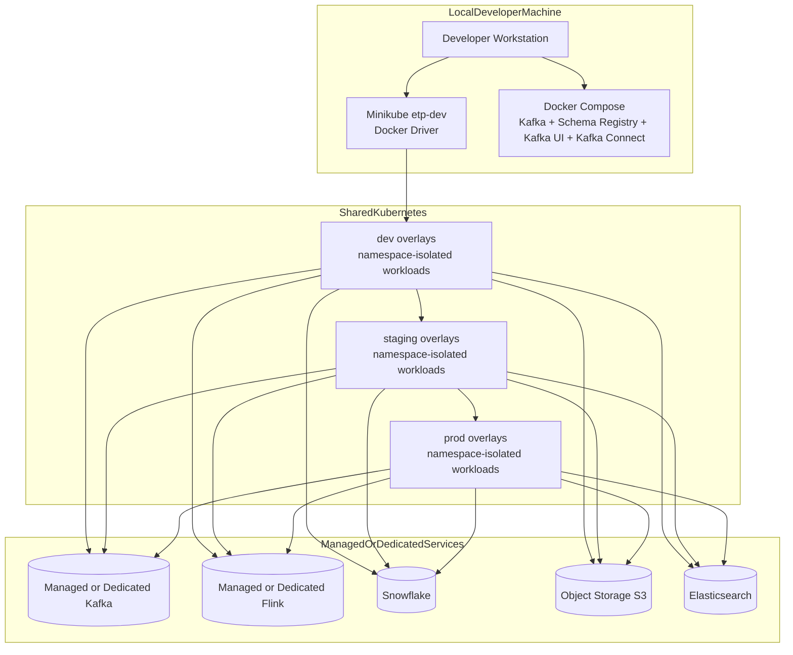

# Deployment Architecture

## Purpose

This document describes how the platform is deployed across local development and shared environments, and how infrastructure components map to each stage.

For namespace-level runtime placement, promotion flow, and environment delta details, see `deployment-runtime-topology.md`.

## Deployment View

## Environment Model

### Local development

- Development is maintained with two supported options.
- Option A: Minikube with Kubernetes pods
- Option B: pure Docker Compose

#### Option A: Minikube with pods

- Uses Minikube with Docker driver as a local Kubernetes runtime
- Uses repository overlays and namespace guardrails for higher environment parity
- Best for validating Kubernetes policies, namespace topology, and pod-level behavior

#### Option B: pure Docker Compose

- Uses Compose services for local Kafka ecosystem iteration without Kubernetes
- Best for rapid local development of topic, connector, and schema workflows
- Recommended when developer machines cannot allocate enough resources for Minikube

Developers should choose Option A for deployment parity tests and Option B for fast integration loops.

### Shared Development, QA, and Staging

- Kubernetes overlays under infra/kubernetes/overlays define environment-specific resources.
- Namespaces follow environment-domain-workload conventions.
- Resource quotas, limit ranges, and default-deny network policies are mandatory.
- Promotions use immutable artifacts from lower to higher environments.
- QA, staging, and production are deployed through Helm with environment-specific values.
- QA keeps minimal pod configuration (low replica counts and lower resource requests/limits) while preserving production-like topology.
- Detailed per-environment runtime deltas are maintained in deployment-runtime-topology.md to avoid duplicated diagram maintenance.

### Production

- Production runs in dedicated cluster boundaries with stricter operational controls.
- Kafka and Flink can be managed services or dedicated production-grade deployments, per ADR 0003.
- Critical serving stores (Snowflake, Elasticsearch, object storage) are externally managed and integrated through controlled networking and credentials.
- Production follows the same Helm chart structure as QA/staging, with stricter values for scale, security, and resiliency.

## Control Planes and Tooling

- Kubernetes manifests and overlays: infra/kubernetes
- Helm chart deployments for QA/staging/production: infra/helm
- Local cluster bootstrap: scripts/dev/setup_minikube_docker.sh
- Overlay deployment helper: scripts/dev/apply_k8s_overlay.sh
- Local Kafka ecosystem stack: infra/docker/docker-compose.kafka.yml
- Pure Compose runbook: docs/runbooks/local-dev-docker-compose.md
- Dead-letter smoke validation: scripts/dev/smoke_test_kafka_connect_dlq.sh

## Deployment Guardrails

- Environment-specific namespaces with team-scoped RBAC bindings
- Default-deny network policies with explicit allow-list flows
- Source-controlled topic maps, schema definitions, connector configs, and index templates
- ADR-based change log to capture material architecture and operations decisions

## Related ADRs

- ADR 0001: Base platform on Kubernetes in public cloud
- ADR 0002: Namespace and tenancy strategy
- ADR 0003: Managed versus self-hosted Kafka and Flink
- ADR 0004: Decouple Flink and Elasticsearch with Kafka Connect
- ADR 0005: Dead-letter strategy for malformed operational events
- ADR 0006: Minikube Docker local development standard
