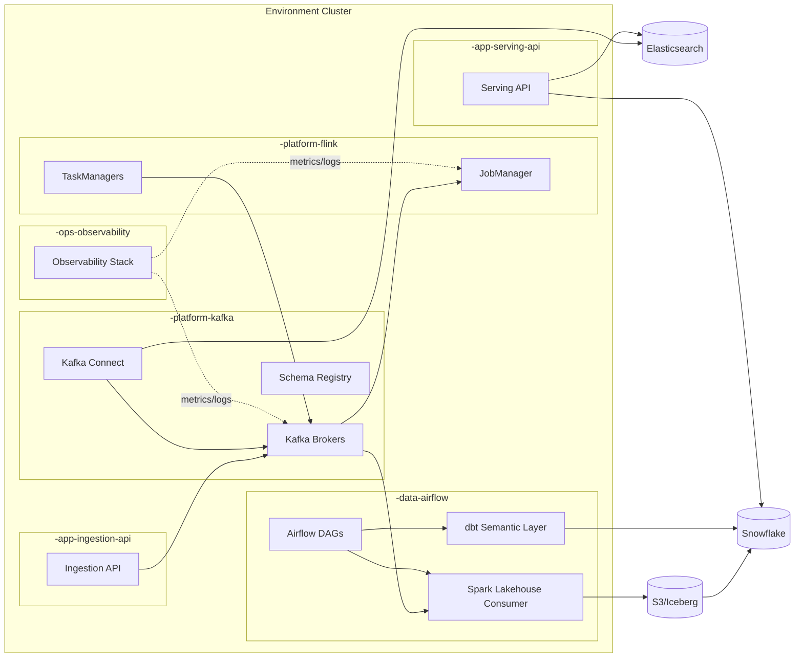
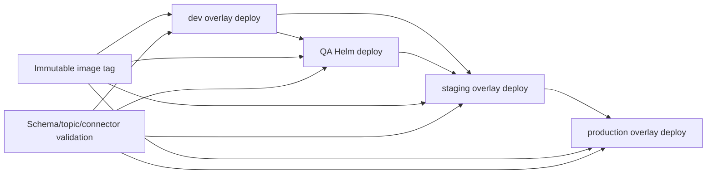

# Deployment Runtime Topology

## Purpose

This document complements deployment-architecture.md by defining runtime placement details: namespace topology, component placement, network boundaries, and promotion flow across environments.

## Runtime Topology Diagram

## Environment delta summary

The runtime wiring stays consistent across environments; only sizing, management model, and operability controls change.

| Environment | Runtime model | Helm profile | Sizing posture | Security/operability posture |
| --- | --- | --- | --- | --- |
| dev | Local Minikube or shared dev cluster | optional overlays, baseline values | minimal to moderate | namespace guardrails and smoke checks |
| QA | Shared Kubernetes cluster | qa values | minimal (production-like topology) | promotion validation gates |
| staging | Shared Kubernetes cluster | stg values | moderate | pre-production validation and approval gate |
| production | Dedicated/isolated cluster boundary | prod values | scaled/HA | ingress TLS, HPA, PDB, NetworkPolicy, rollback controls |

Use deployment-architecture.md for deployment options and this document's runtime topology diagram for communication flow.

## Namespace Placement

Namespace naming follows ADR 0002:

- `<env>-platform-kafka`
- `<env>-platform-flink`
- `<env>-app-ingestion-api`
- `<env>-app-serving-api`
- `<env>-data-airflow`
- `<env>-ops-observability`

Where `<env>` is one of `dev`, `qa`, `staging`, `prod`.

## Component Placement Matrix

| Component | dev | QA | staging | production |
| --- | --- | --- | --- | --- |
| Kafka brokers | Kubernetes (self-hosted/local capable) | Managed or dedicated | Managed or dedicated | Managed or dedicated |
| Kafka Connect | Kubernetes/local compose | Kubernetes pods via Helm (minimal) | Kubernetes pods via Helm | Kubernetes pods via Helm |
| Flink runtime | Kubernetes/self-hosted | Managed or dedicated | Managed or dedicated | Managed or dedicated |
| Ingestion API | Kubernetes app namespace | Kubernetes pods via Helm (minimal) | Kubernetes pods via Helm | Kubernetes pods via Helm |
| Serving API | Kubernetes app namespace | Kubernetes pods via Helm (minimal) | Kubernetes pods via Helm | Kubernetes pods via Helm |
| Airflow/dbt runners | Kubernetes data namespace | Kubernetes pods via Helm (minimal) | Kubernetes pods via Helm | Kubernetes pods via Helm |
| Elasticsearch | External managed or dedicated | External managed or dedicated | External managed or dedicated | External managed or dedicated |
| Snowflake | External managed | External managed | External managed | External managed |

## Network and Security Boundaries

- Default deny network policy in each namespace
- Explicit allow-list rules for service-to-service traffic:
  - ingestion API -> Kafka
  - Flink -> Kafka
  - serving API -> Kafka (where required)
- Team-scoped RoleBindings per namespace
- Secrets scoped by namespace/environment

## Promotion Flow

Promotion principles:

- Promote immutable artifacts, do not rebuild per environment
- Apply the same base manifests with overlay-only deltas
- Validate topic/connector/schema conformance before each promotion step
- Keep staging and production on the same Helm chart set, differing only by values files

## Local-to-Shared Parity Notes

- Local development supports two operation modes.
- Option A: Minikube with pods for namespace and policy parity
- Option B: pure Docker Compose for lightweight local integration
- Local Minikube uses the same namespace conventions and overlay assets as shared environments
- Local Docker Compose stack is used for fast Kafka ecosystem iteration, while shared environments rely on cluster-managed or managed services
- Smoke test coverage for Kafka Connect DLQ path should run before promoting connector changes

## Related documents

- `docs/architecture/deployment-architecture.md`
- `docs/architecture/system-architecture.md`
- `docs/architecture/spring-boot-framework-and-patterns.md`
- `docs/runbooks/local-dev-minikube.md`
- `docs/adr/0002-kubernetes-namespace-and-tenancy-strategy.md`
- `docs/adr/0003-managed-vs-self-hosted-kafka-flink.md`
- `docs/adr/0004-decouple-stream-processing-and-search-sinks-with-kafka-connect.md`
- `docs/adr/0007-deploy-airflow-workloads-as-kubernetes-pods.md`
