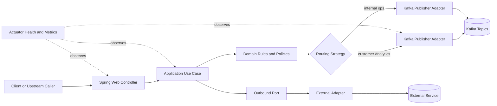
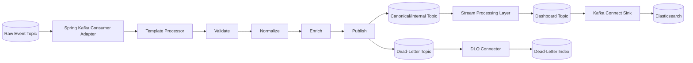

# Spring Boot Framework and Design Patterns

## Purpose

This document defines the Spring Boot architecture approach for API and streaming-adjacent services, and standardizes design patterns for workflow orchestration and pipeline integration.

## Framework Baseline

- Java 17+
- Spring Boot 3.x
- Spring Web for synchronous API surfaces
- Spring Kafka for producer/consumer boundaries where Spring-based services interact with topics
- Spring Actuator for health, readiness, and metrics endpoints
- Optional Spring Data modules for service-owned state

## Architectural Style

Spring Boot services should follow a ports-and-adapters (hexagonal) layout so business logic remains independent from transport and infrastructure details.

Recommended package structure:

- `api`: controllers and request/response DTOs
- `application`: use cases, orchestration services
- `domain`: domain entities, value objects, business rules
- `ports`: inbound/outbound interfaces for external dependencies
- `adapters`: Kafka, storage, external APIs, mapper adapters
- `config`: Spring configuration and bean wiring

## Design Patterns

### 1. Hexagonal Architecture

- Keeps domain and use-case logic independent from frameworks
- Improves testability and service evolution speed

### 2. Strategy Pattern for Routing and Policy Selection

- Select event handling strategy by event type, tenant class, or channel
- Select sink behavior (for example strict vs best-effort policy) without branching sprawl

### 3. Template Method Pattern for Processing Pipelines

- Shared event-processing skeleton:
  - validate
  - normalize
  - enrich
  - publish
- Service-specific steps override extension points only

### 4. Factory Pattern for Serialization and Topic Clients

- Centralized creation of serializer/deserializer combinations
- Reduces scattered topic configuration and inconsistent producer setup

### 5. Resilience Pattern Set

- Retry with bounded backoff for transient dependencies
- Circuit breaker for downstream instability
- Timeout and bulkhead controls for external APIs

## Service Workflow Diagram

## Pipeline Workflow Diagram

## Integration Guidelines

- Keep controller classes thin; orchestration belongs in application use cases
- Prefer immutable DTOs and explicit mappers at adapter boundaries
- Keep Kafka topic names and schema references externalized in configuration
- Emit domain-level events from use cases; map to transport payloads in adapters
- Include contract tests for topic payloads and integration tests for strategy selection

## Related documents

- `docs/architecture/system-architecture.md`
- `docs/architecture/deployment-architecture.md`
- `docs/architecture/deployment-runtime-topology.md`
- `docs/adr/0004-decouple-stream-processing-and-search-sinks-with-kafka-connect.md`
- `docs/adr/0005-dead-letter-topic-strategy-for-malformed-operational-events.md`
