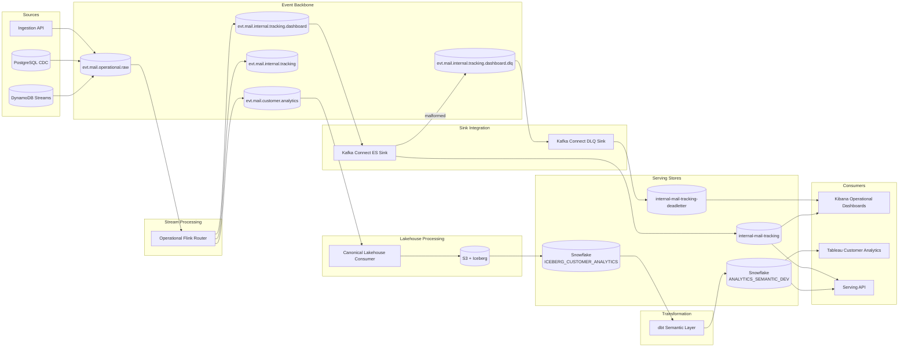

# System Architecture

## Purpose

This document captures the current target architecture for the Event Tracking Platform, aligned with accepted ADRs and the latest implementation updates.

## Architecture Goals

- Support customer-facing analytics and internal operational mail tracking from shared event flows
- Decouple stream processing from destination-specific sink behavior
- Keep contracts, topic boundaries, and serving layers explicit and versioned
- Provide a reproducible local Kubernetes development workflow

## Logical Architecture

## Layer Responsibilities

### Source and Ingestion Layer

- DynamoDB stream changes are produced into Kafka through Lambda producer logic
- Additional lifecycle events can enter via API ingestion and CDC pathways
- Raw source events land in versioned Kafka topics with documented ownership

### Streaming Layer

- Flink performs normalization and enrichment
- Flink publishes internal tracking streams and dashboard-ready streams to Kafka
- Flink does not write directly to Elasticsearch for operational dashboards

### Integration and Sink Layer

- Kafka Connect handles Elasticsearch indexing from internal dashboard topic
- Connector-level dead-letter routing isolates malformed records
- A second connector sinks dead-letter records into a dedicated index for triage

### Analytics and Serving Layer

- Customer analytics pipeline lands canonical data to Iceberg on object storage
- dbt semantic layer materializes Snowflake models for Tableau
- Elasticsearch supports low-latency operational search and dashboard use cases

## Key Architectural Decisions

- ADR 0001: Kubernetes as the base runtime platform
- ADR 0002: Environment-first namespace strategy and guardrails
- ADR 0003: Hybrid managed/self-hosted operating model
- ADR 0004: Flink to Kafka Connect sink decoupling for Elasticsearch
- ADR 0005: Dead-letter strategy for malformed operational events
- ADR 0006: Minikube on Docker for local Kubernetes development

## Deployment Topology

- Deployment and environment-specific topology are maintained in dedicated deployment documents to avoid drift between architecture pages.
- Refer to deployment-architecture.md for environment model and deployment workflows.
- Refer to deployment-runtime-topology.md for namespace placement, runtime boundaries, and promotion flow.

## Operability and Validation

- Smoke test script validates connector registration, malformed publish path, and dead-letter indexing
- Topic and schema metadata maintained as source-controlled assets
- ADR index in docs tracks architectural evolution over time

## Related Architecture Docs

- `docs/architecture/deployment-architecture.md`
- `docs/architecture/deployment-runtime-topology.md`
- `docs/architecture/spring-boot-framework-and-patterns.md`
