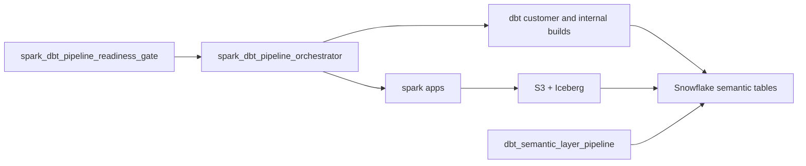
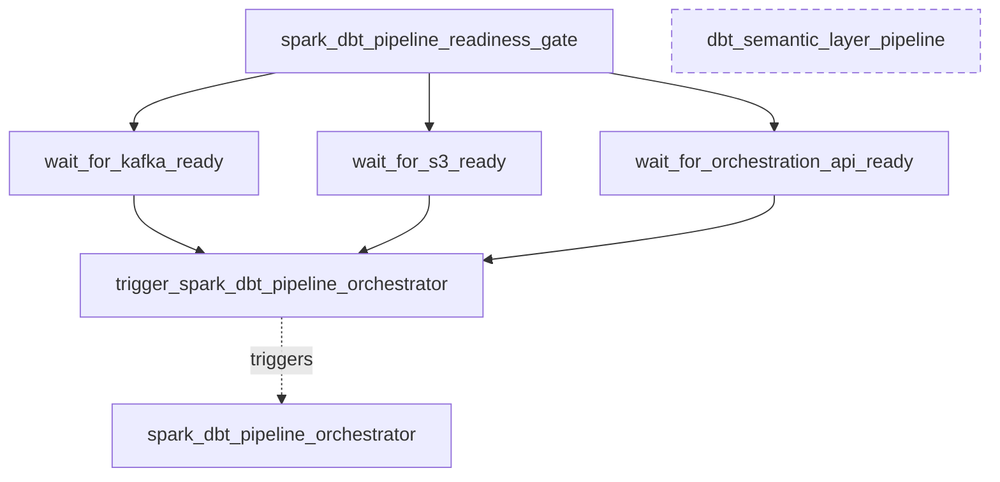
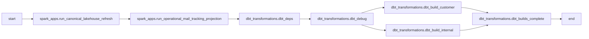

# Airflow DAG Orchestration Workflows

## Purpose

This page contains the canonical DAG orchestration diagrams for the local and shared Airflow workflows.

## End-to-end workflow diagram

## Cross-DAG orchestration

## Spark plus dbt orchestration DAG

## dbt semantic layer DAG (isolated)

```mermaid
flowchart LR
    S[start] --> A[dbt_semantic_layer_pipeline.dbt_deps]
    A --> B[dbt_semantic_layer_pipeline.dbt_debug]
    B --> C[dbt_semantic_layer_pipeline.dbt_build_source]
    C --> D[dbt_semantic_layer_pipeline.dbt_build_staging]
    D --> E[dbt_semantic_layer_pipeline.dbt_build_intermediate]
    E --> F[dbt_semantic_layer_pipeline.dbt_build_marts]
    F --> G[end]
```

## Related documents

- [platform/airflow/README.md](../../platform/airflow/README.md)
- [docs/architecture/system-architecture.md](../architecture/system-architecture.md)
- [docs/diagrams/platform-architecture.md](platform-architecture.md)
