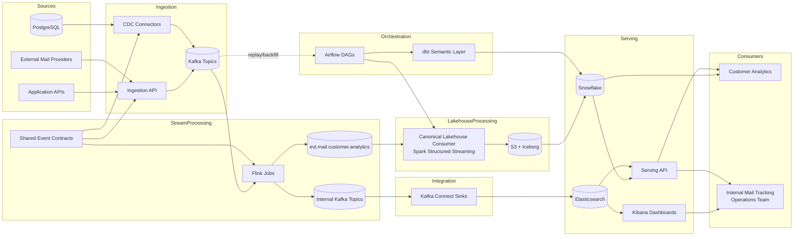

# Platform Architecture

## Overview

This page keeps a single high-level diagram for fast orientation. Detailed architecture and environment-specific diagrams are maintained in system and deployment architecture docs.

## System Diagram

## Notes

- Ingestion and CDC publish into Kafka as the shared event backbone.
- Flink publishes internal Kafka topics; Kafka Connect handles Elasticsearch sink delivery.
- Snowflake and Elasticsearch remain consumer-specific serving stores.
- Use system architecture and deployment docs for detailed flow and runtime topology.

## Repository Mapping

- `platform/kafka/`: transport, schemas, and connector configuration
- `platform/flink/`: stream processing and real-time projections
- `platform/airflow/`: orchestration and dependency scheduling
- `platform/dbt/`: warehouse transformation layers
- `storage/snowflake/`: warehouse DDL and procedural objects
- `storage/elasticsearch/`: operational search configuration
