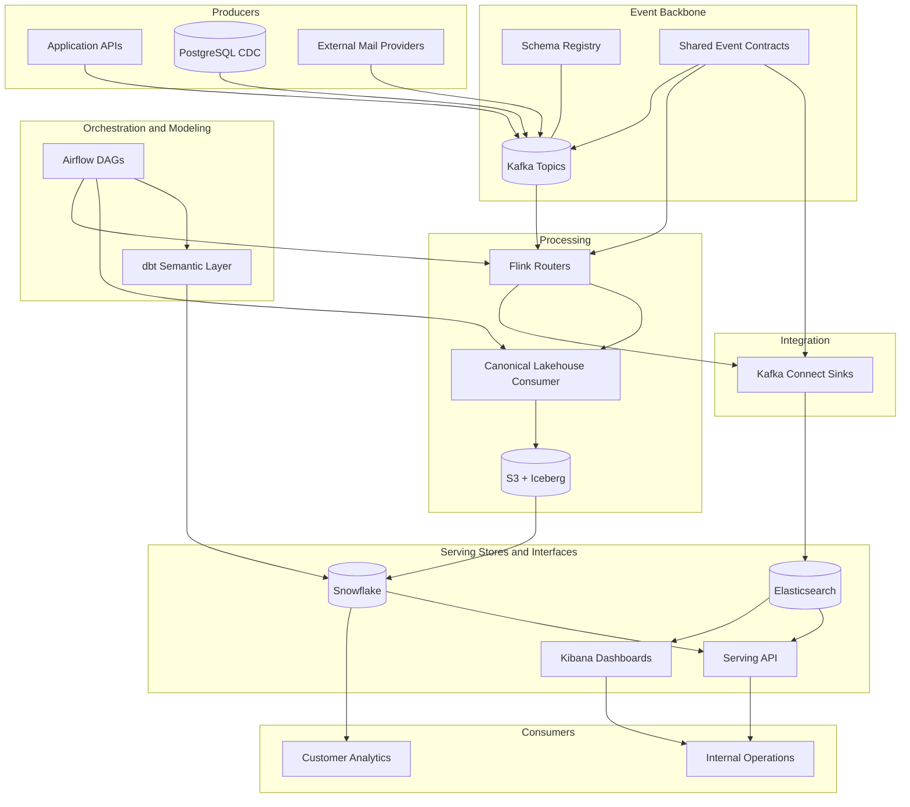

# Event Tracking Platform Components Architecture

## Overview

This page keeps a single high-level diagram for fast orientation. Detailed architecture and environment-specific diagrams are maintained in system and deployment architecture docs.

## Components Diagram

## Notes

- Ingestion and CDC publish into Kafka as the shared event backbone.
- Flink publishes internal Kafka topics; Kafka Connect handles Elasticsearch sink delivery.
- Snowflake and Elasticsearch remain consumer-specific serving stores.

## Repository Mapping

- [../../platform/kafka/](../../platform/kafka/): transport, schemas, and connector configuration
- [../../platform/flink/](../../platform/flink/): stream processing and real-time projections
- [../../platform/airflow/](../../platform/airflow/): orchestration and dependency scheduling
- [../../platform/dbt/](../../platform/dbt/): warehouse transformation layers
- [../../storage/snowflake/](../../storage/snowflake/): warehouse DDL and procedural objects
- [../../storage/elasticsearch/](../../storage/elasticsearch/): operational search configuration

## Related documents

- [../architecture/system-architecture.md](../architecture/system-architecture.md)
- [../architecture/deployment-architecture.md](../architecture/deployment-architecture.md)
- [../architecture/deployment-runtime-topology.md](../architecture/deployment-runtime-topology.md)
- [airflow-dag-orchestration.md](airflow-dag-orchestration.md)
